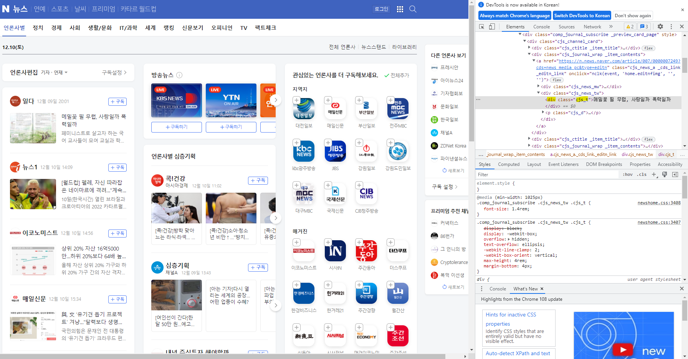
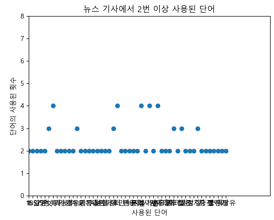
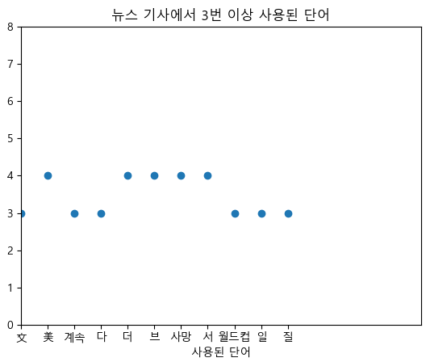

# Naver News Title Crawling Program

2022.12 OpenSourceSoftware Term Project by SeokJune Moon

**Introduction**

Nowadays there are many news and it is **necessary** for us to check today's news everyday.
But we know it is hard to see news everyday because we are all **busy**!!
In order to resolve this problem, I decided to make a program that scraps web site and analyzes articles' titles.

**Contents**

At first, we have to make a request to load Website.
What we get from website by request is just a form of text, so we should parse the data. In this point, I used **BeautifulSoup** to solve this problem.

Then we have to check **website address** and **CSS selector**.

In order to check these, we should open our DevTools(F12) and check location of CSS selector and tag of elements.

After this process, we finally get titles of articles.
Then I splited text and counted how many times each word was used.

I used the news of Saturday, 2022-12-10, 07:00 AM.
As we know, there was a Worldcup yesterday and Brazil was defeated by Croatia.
So many reporters wrote articles about Worldcup and soccer players.

There were too many words to see easily, so I made other scattered one which showed words used more than twice.
 

As we can see, by changing condition, we could see which topic was the most used among reporters.
In this graph, we could see that worldcup is popular among people but news always shows who died because of special issues.
  
**Conclusion**

We could see which topic was mostly interested by people.
  
**References**

BeautifulSoup(https://code.launchpad.net/beautifulsoup/)
